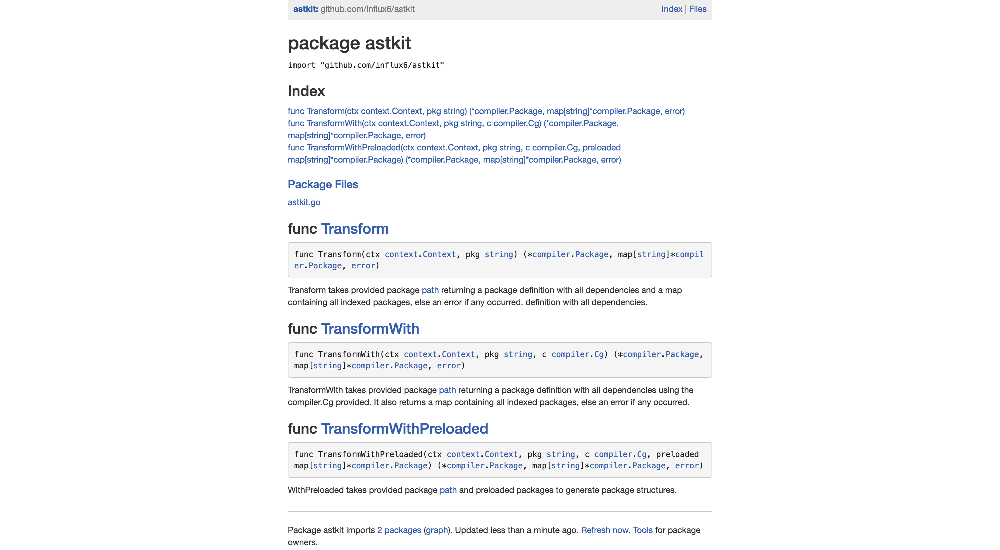

AstKit
---------
[](https://goreportcard.com/report/github.com/influx6/astkit)
[](https://travis-ci.org/influx6/astkit#)
 [](http://godoc.org/github.com/influx6/astkit)
 
AstKit is a library built to help reduce the surface area required to work with the generated AST structures from the internal
Golang runtime [Ast](https://golang.org/pkg/go/ast), [Tokens](https://golang.org/pkg/go/tokens) and [Types](https://golang.org/pkg/go/types)
packages.

### Install

```bash
go get -u github.com/influx6/astkit
```


